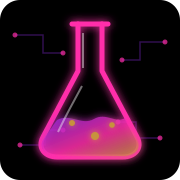

<table align="center">
<tr>

<td align="center" width="120">
  
</td>

<td align="center">
  
</td>

</tr>
</table>

  

  
  
  

<table>
<table>
<tr>

<td width="36%" valign="top">

<h3 align="center">Laboratory Dashboard</h3>

  

  

  

  

  

</td>

<td width="64%" valign="top">

## Lia da Graça

Project Manager and Researcher working at the intersection of artificial intelligence, strategic systems, critical-care prediction, public health, and defence-oriented preparedness for outbreaks, disasters, and complex scenarios.

### Current laboratory directions

- Translational AI for ICU triage and resource allocation
- National-scale health-data modelling
- Process mining for clinical pathways
- Quantum and quantum-inspired machine learning
- Strategic preparedness for complex scenarios

</td>

</tr>
</table>

---

## Research Focus

- AI-driven ICU triage and healthcare resource allocation
- Predictive modelling using national-scale health datasets
- Reproducible computational infrastructures for translational decision support
- Outbreaks, disasters, and complex scenarios
- Quantum technologies and the transition from classical AI to Quantum AI
- Quantum-enhanced time-series prediction and hybrid quantum–classical algorithms

---

## Academic Background

- **PhD in Sciences** (Artificial Intelligence for ICU and Outbreak Scenarios) — Universidade Federal de São Paulo (UNIFESP)
- **Visiting PhD Researcher** — Universidad de Alicante, Spain
- **Postgraduate Certificate in Public Economics and Finance** — Fundação Getulio Vargas (FGV)
- **MSc Exchange Program** — ESADE Business School, Barcelona
- **MSc in Organizational Networks** — Universidade Paulista (UNIP)
- **Alma mater** — Fundação Getulio Vargas (FGV EAESP)

---

## Technology Stack

  

---

  <strong>Excellence for complex systems is not a luxury — it is a responsibility.</strong>

